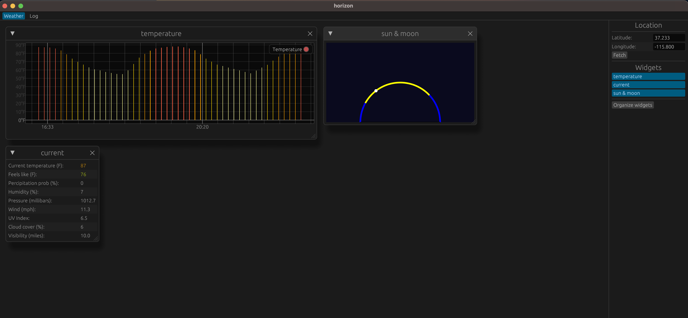

# horizon

A WIP weather visualization app.

:pushpin: See the [project roadmap](ROADMAP.md) for planned features and milestones.

:art: Built with [egui](https://github.com/emilk/egui)

:zap: powered by [Pirate Weather](https://pirateweather.net/en/latest/)

:rocket: deployed via [GitHub Pages](https://pages.github.com/).

## Dependencies

TBD

## License

This project uses AGPL-3.0 to ensure that it remains open and non-commercial.
